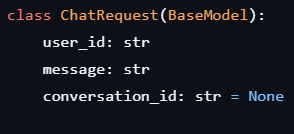

# 🎓 Assignment Instructions

## 📘 Title: Frontend and Backend Dev

### 🗓️ Deadline: Wednesday, 18 June

---

## 📝 Objective
The objective of this assignment is to implement a simple backend - frontend framework that generates music based on a text prompt.

---


## 📂 What You Need to Do
> ⚠️ **Important:** music_generator.py is only used to test for audio response for text input and it has nothing relation with our project, so don't worry about its complete code but you can focus on "generate_audio_from_text()" function

1. You already have forked and cloned the repo, so just Sync it with the main branch

2. Create a folder in submissions folder named as : `{<your_roll_no>-<your_name>}`
## Final structure for Submission:

```text
Your Folder/
├── frontend    
    └── src/routes/
        └── +page.svelte   
└──  backend
    ├── music_generator.py
    └──  app.py
```

3. Implement the following:
   - Take a look at `music_generator.py` file in main branch and copy it to backend folder, we will be using it to mimic the output of the model, since model is not finished yet.
   - Create `app.py` for your FastAPI server that exposes a `/generate` and `/health-check` endpoint
   - Create a simple frontend with a text box, a button and audio playback which interacts with the backend using `svelte`
   - (optional) If you want you can design it on your own using `CSS`, you can explore some js libraries like `wavesurfer.js`
---

## 💡 Hints 
  
1. For Frontend : Go check the resources previously shared for `Svelte` and read about these funtions in javascript : `alert()`, `fetch()`.
    - use commands to create a svelte app, you have to add a textArea field, two buttons `status`- /helth-check and `submit` - /generate, and audio tag for the response audio with all controls.
    - Add on:click properties to each button and provide the response audio as `src` to `<audio>`
    - the response of `/health-check` must be an alert, if user clicks `status`.
    - the submit button calls `fetch([...])`
2. For Backend :
    - I have imported all the required modules just copy the content of Assignment file into your `app.py`.
    - Sample for request and response class, from the code discussed:
        
    - To add middleware : use `app.add_Middleware()` and further read about its params
    - use `POST` method for both routes.
    - for `generate route` to return audio as response use `return StreamingResponse(...)` and keep `media_type = "audio/wav"`
    - for `health-check route`, You have to return the response as `"healthy"` in form of `Response` class you created. 
    - run the backend using `uvicorn.run(...)`
    


## ⚙️ Requirements

- Python 3.8+
- `FastAPI`, `uvicorn`, `numpy`, `scipy`
- Audio must play correctly in a browser `<audio controls>` tag
---

## ✅ Deliverables

- `app.py` — FastAPI backend with `/generate` and `/health-check` endpoints
- `+page.svelte` with `<textarea>`, `<button>` and `<audio>`
- As soon as you finish this, Push it to your forked repo and create a PR with title "RollNo - Assignment Submisison"

---


## 💬 Questions?
 Ask on the Whatsapp Group or DM me (Aaditya).

---

Good luck! 🍀
